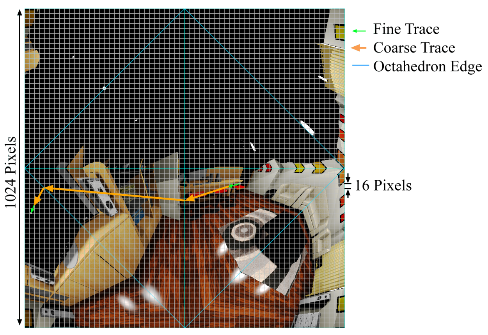
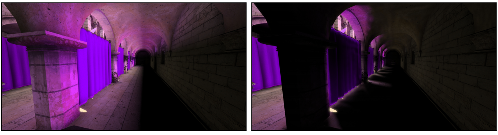

# Light Field Probes

该文创建了一种新的数据结构Light Field，用来处理静态场景的全局光照

文章开头提出，当今的全局光照，大多使用Light Probe和屏幕后效，但

- Light Probe的摆放存在美术上手门槛，摆放不好效果很差
- 屏幕后效限制于屏幕空间，会丢失屏幕外细节，在边界处效果也不好

而作者的方案，即有匹敌光线追踪的画面，又有屏幕空间算法级别的性能，那么这么厉害的算法，具有由什么组成呢？

- 新的数据结构Light Field，存储了场景的几何信息和radiance信息，能用来做光场的可见性查询
- 高效的Light Field构建算法，不依赖任何surface parameterization
- 基于Light Field的光追算法，能直接被shader调用
- 通过Visibility对(ir)radiance map进行滤波、采样，以提高渲染效果
- 在延迟渲染中，可以实时评估（？）

### Light Field

- radiance
- normal
- distance map

下图为Sponza场景的Light Field信息，使用**八面体映射（Octhedral Mapping）**而非Cubemap


使用世界坐标+空间角对Light Field进行采样

#### 八面体映射


```c#
//用于判断在第几象限
float2 Sign(float2 uv){
    return float2((uv.x >= 0.0) ? +1.0 : -1.0, (uv.y >= 0.0) ? +1.0 : -1.0);
}
//三维转二维（球到面）
float2 SphereToOctahedron(in float3 v){
    float2 p = v.xy * (1.0 / (abs(v.x) + abs(v.y) + abs(v.z)));
    return (v.z <= 0.0) ? ((1.0 - abs(p.yx)) * Sign(p)) : p;
}
//二维转三维（面到球）
float3 OctahedronToSphere(float2 e){
    float3 v = float3(e.xy, 1.0 - abs(e.x) - abs(e.y));
    if (v.z < 0) v.xy = (1.0 - abs(v.yx)) * Sign(v.xy);
    return normalize(v);
}
```

$$
p.x=\frac{v.x}{|v.x|+|v.y|+|v.z|}\\
p.y=\frac{v.y}{|v.x|+|v.y|+|v.z|}\\
p.z=1-|p.x|-|p.y|=\frac{|v.z|}{|v.x|+|v.y|+|v.z|}
$$

八面体映射简单高效，分布均匀，而且存储空间小（跟Cubemap比），但边缘处有锯齿，需要配合一些采样滤波方案


### Ray Tracing

```python
def lightFieldTrace(ray):
	result = UNKNOWN
	while result == UNKNOWN:
		choose the next probe
		(result, endpoint) = singleProbeTrace(ray, probe)
		ray.origin = endpoint # Advance the ray to the last point checked
	return result

def singleProbeTrace(ray, probe):
	compute the four 2D polyline segments
	for each polyline segment:
		for each 2D pixel and corresponding 3D point on the segment:
			compare the voxel in the radial distance texture to the ray:
				if hit: return (HIT, point)
				if hidden behind surface: return (UNKNOWN, point)
				# (otherwise, keep iterating)
	return (MISS, last polyline endpoint) # Reached the end of the line
```

这是一种基于Probe的Ray Tracing算法

- 选中一个Probe（每一个Probe就是一个八面体）
- 在这个Probe内部光追
  - 一直重复直到hit/miss

#### 选择一个Probe

寻找一个中心最靠近Ray的Probe

#### 在Probe内部追踪

三维空间的线段，被转化为2D平面上的折线段。这个折线段最多有四段，并且每一段单独位于某个象限中。

三维空间的线段与三个轴向平面的**交点**，投影到2D，**就是**这个折线段的**拐点**



求交思路：Probe上存储了场景中的Radial depth，若这个深度小于**折线到Probe中心的距离**，光线要么击中表面，要么从表面后面经过

when the stored radial depth of the scene is less than the radial distance from the probe’s center to the 3D polyline at the currently marched polyline texel, the ray has either hit a surface or passed behind the surface.

#### fallback

若在单个Probe内光追没法得到hit/miss，那么我们需要找到一个新的Probe，作者的思路是寻找离当前Probe尽可能远的Probe

### 渲染

使用传统光栅化+shadowmap渲染直接光下的场景，再使用光追求间接光（漫反射），也就是说，光追只是一种间接光方案

对于高频的间接光，可能会出现视差问题，但作者打算放在未来处理

作者在GBuffer中单独开了一个通道来存储间接光，将其降噪滤波处理后，进行PBR计算（BRDF），将结果和直接光的framebuffer相加

### 结果

#### 漏光现象

现在的GI方案很多都存在漏光现象，尤其是：

- 当一个probe在一个物体内部，这会导致变黑
- 当一个probe周围灯光变化过快（rapidly），表现为灯光透过了墙壁

作者的方案通过visibility，对间接光进行预处理，于是减轻了灯光穿墙的现象

*左为传统方案，右为作者方案*



