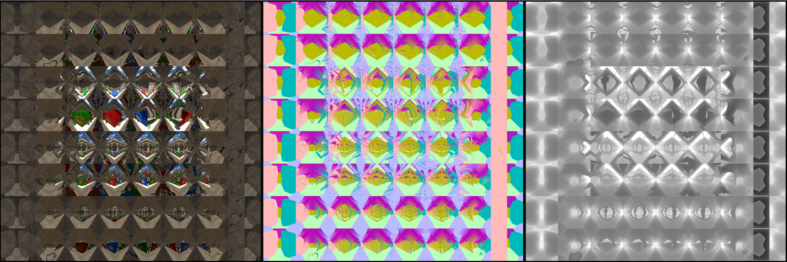
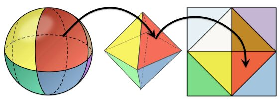
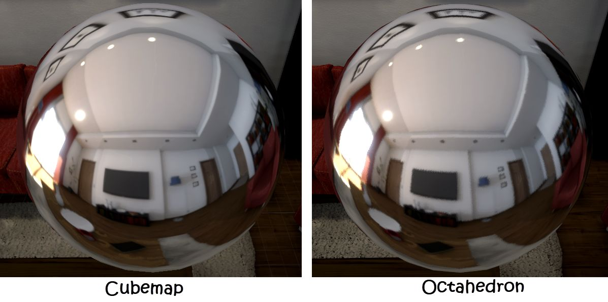

# Light Field Probes

该文创建了一种新的数据结构Light Field，用来处理静态场景的全局光照

文章开头提出，当今的全局光照，大多使用Light Probe和屏幕后效，但

- Light Probe的摆放存在美术上手门槛，摆放不好效果很差
- 屏幕后效限制于屏幕空间，会丢失屏幕外细节，在边界处效果也不好

而作者的方案，即有匹敌光线追踪的画面，又有屏幕空间算法级别的性能，那么这么厉害的算法，具有由什么组成呢？

- 新的数据结构Light Field，存储了场景的几何信息和radiance信息，能用来做光场的可见性查询
- 高效的Light Field构建算法，不依赖任何surface parameterization
- 基于Light Field的光追算法，能直接被shader调用
- 通过Visibility对(ir)radiance map进行滤波、采样，以提高渲染效果
- 在延迟渲染中，可以实时评估（？）

### Light Field

- radiance
- normal
- distance map

下图为Sponza场景的Light Field信息，使用**八面体映射（Octhedral Mapping）**而非Cubemap



使用世界坐标+空间角对Light Field进行采样

#### 八面体映射



```c#
//用于判断在第几象限
float2 Sign(float2 uv){
    return float2((uv.x >= 0.0) ? +1.0 : -1.0, (uv.y >= 0.0) ? +1.0 : -1.0);
}
//三维转二维（球到面）
float2 SphereToOctahedron(in float3 v){
    float2 p = v.xy * (1.0 / (abs(v.x) + abs(v.y) + abs(v.z)));
    return (v.z <= 0.0) ? ((1.0 - abs(p.yx)) * Sign(p)) : p;
}
//二维转三维（面到球）
float3 OctahedronToSphere(float2 e){
    float3 v = float3(e.xy, 1.0 - abs(e.x) - abs(e.y));
    if (v.z < 0) v.xy = (1.0 - abs(v.yx)) * Sign(v.xy);
    return normalize(v);
}
```

$$
p.x=\frac{v.x}{|v.x|+|v.y|+|v.z|}\\
p.y=\frac{v.y}{|v.x|+|v.y|+|v.z|}\\
p.z=1-|p.x|-|p.y|=\frac{|v.z|}{|v.x|+|v.y|+|v.z|}
$$

八面体映射简单高效，分布均匀，而且存储信息少（跟Cubemap比），但边缘处有锯齿，需要配合一些采样滤波方案


