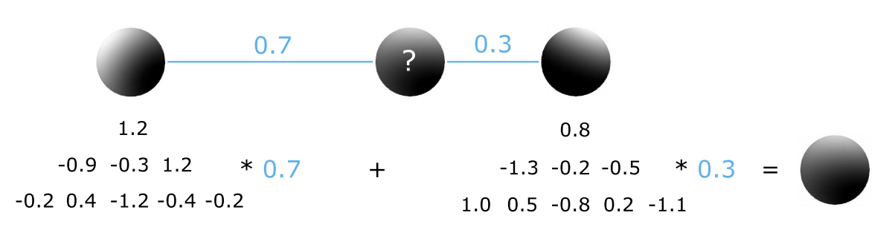
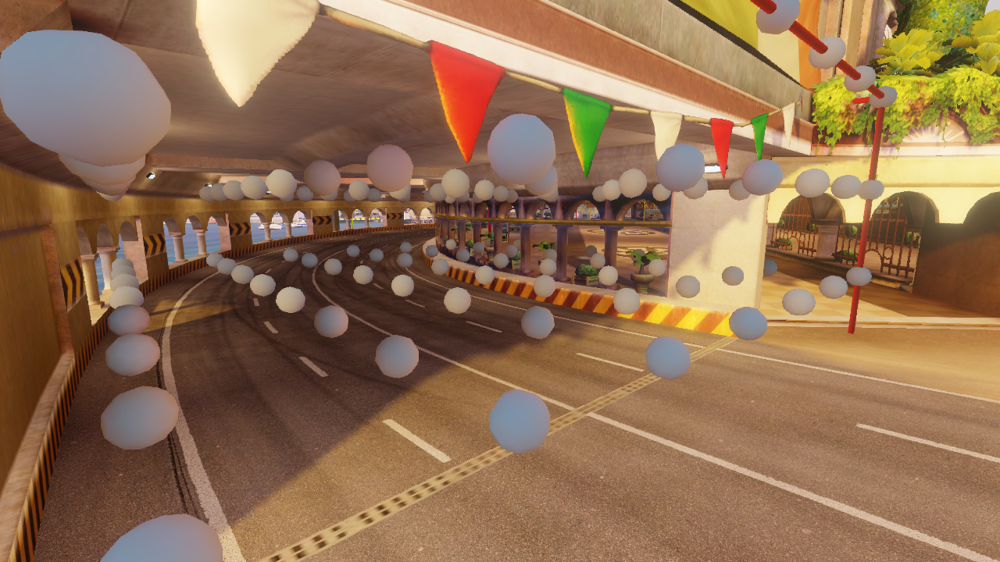
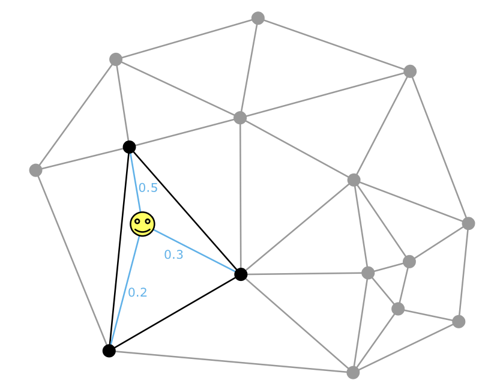
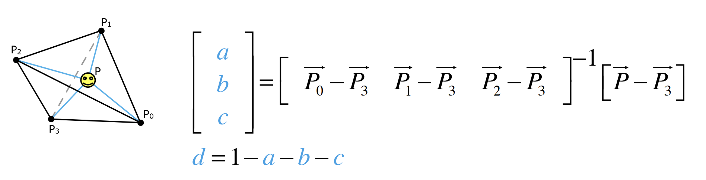
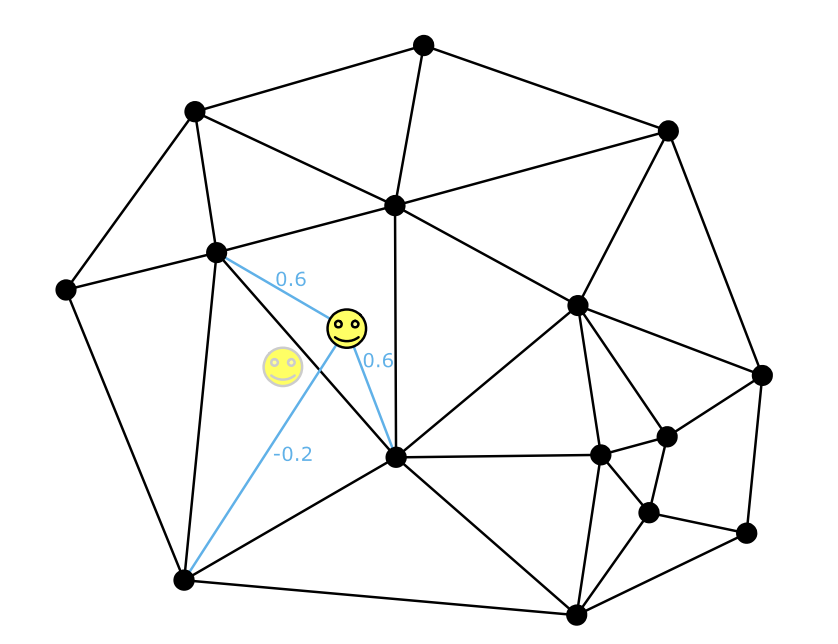
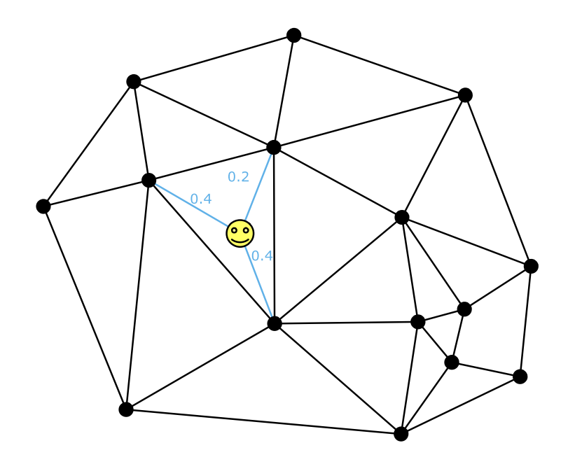

# Light probe interpolation

### Light Probe

Light Probe内存储了多个信息（感兴趣可以去看Unity的`LightmapSettings.lightProbes`API）

- probe的位置（float3）
- 球谐系数SH（二阶9个float3）
- hull rays（float3）//这个不重要，Unity是没有的
- 邻接图（4个顶点的id，4个邻居的id，矩阵）

Light Probe内存储的SH系数，其实是广义傅里叶变化的系数（其通项基底为球谐函数），将这些系数与基底相乘相加，就能拟合成一个函数。该函数的自变量通常为法线，函数值为光照信息

无穷级数有一个性质，通项的线性组合不会改变和函数的收敛性，而且其和函数也是对应线性和。也就是球谐系数是可以线性插值的

不仅可以插值，我们还可以通过对两组SH系数进行插值，得到一个新的SH，这也是这篇文章的核心前提

### 插值

对于一个点，我们应该用那些probes进行插值呢？这些probes又应该用多少权重呢？

#### 一个好的插值算法

在说具体的插值方案前，我们需要先知道何种方案好

- smooth
- exact
- local

#### 传统方案

（2012年的传统方案）

从摆放入手，只要probe都沿着obb整齐摆放，那么自然好插值（很像Volume GI）

为了提高空间利用率，可以使用八叉树对空间进行划分（会让插值变得更复杂）

**缺点**

- 数据过多，没有侧重点（有的地方应该点数多，有的地方应该点数少）
  - 即使可以设置摆放密度，但场景中光照的变化过于细腻，增大美术负担
- 可见性问题
  - probe不可避免的会穿墙，于是导致漏光、变黑等issue（于是很多方案中probe会带着AO信息）

#### 作者的方案

（这应该和Unity内置的Light Probe是同一种方案，放在现在，很“传统”）

以2D为例

- probe可以任意摆放
- 相邻probe连线，构建出一个**邻接图**
- 着色点用笑脸表示，查找其所在的三角形，用三角形的顶点进行插值

转化到三维就是空间四面体（tetrahedron）

### 查找

#### 重心公式

第一步就是查找着色点在哪一个空间四面体中

我们可以通过重心公式来判断点是否在空间四面体内，若有负数分量，则在其外

#### 邻接图

空间中probe点构成了邻接图，在2D，每个图是一个三角形，每个图最多会有三个邻居（三维是四个邻居）

我们让每一个图都记录其邻居的ID

对于某个着色点（笑脸），我们先随意取一个图（三角形），通过重心公式求三个系数

我们发现有一个系数是负数，那么选择负数反方向（在上图的右上角）的邻居再次进行计算，直到发现全是正数，那么我们就找到了着色点所在的位置

为了加速这一过程，我们需要寻找一个好的方法，去**猜**初始的空间四面体

