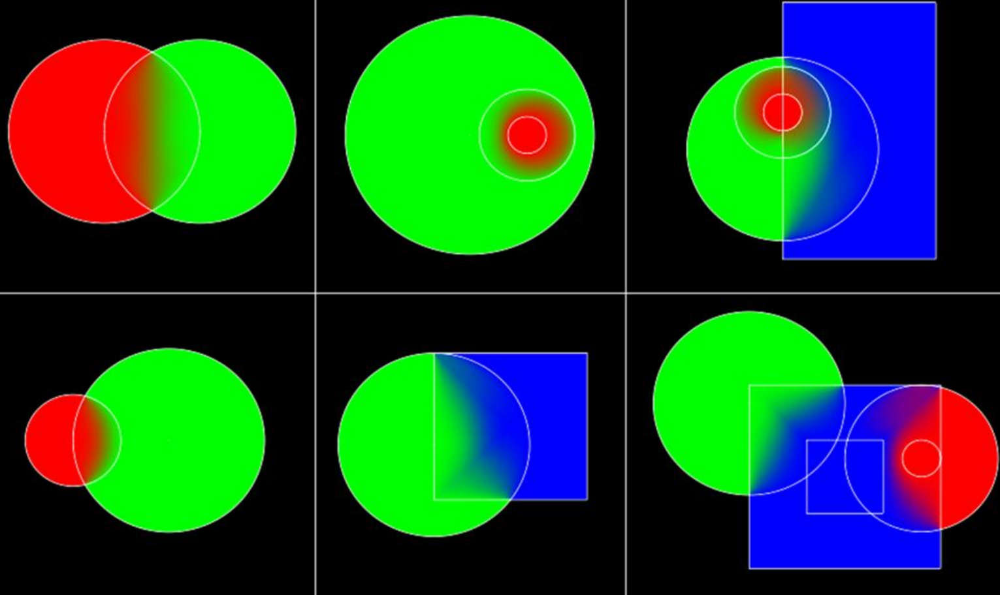

# Parallax-corrected Cubemap

### IBL

Distant IBL（如无穷远的Cubemap）在处理无穷远的光照时效果不错，着色平滑

Loacl IBL（如逐物体、逐空间的Cubemap）就出现了很多问题

**若一个Mesh横跨两个区域，会出现渲染错误、交界线**


**视差问题：场景物体的反射光不在正确的位置**

这个很好理解，我们用这种办法计算反射光时，并没有用到场景物体的位置，只是单纯用法线、镜头矩阵去采样Cubemap，尤其是镜头移动时，问题会更明显

### 接缝问题

为了解决接缝问题，作者给的方案是**混合**

- 将场景划分为多个区域，不同区域有一个Cubemap
- **根据位置**，将周围多个Cubemap进行混合，生成一个临时Cubemap


作者将自己这套方案称为Point of interest（POI），在他的方案中，是根据相机/Player所在的位置进行混合的

#### Gather loacl cubemaps

而收集周围Cubemap，作者给出了一个方案：

- 给每一个Cubemap设置一个influence volume（这个volume是互相重叠的）
- 遍历所有Cubemap，若POI在其volume外，则不使用
- 使用八叉树来加速遍历
- 为了性能，限制了参与混合的Cubemap的最大数量

#### 混合算法

如何将多个Cubemap混合成一个Cubemap呢？我们需要先知道**权重**

作者的方案有些依赖美术，美术在制作Cubemap时，需要设定volume的边界

- POI在边界内，只使用这一个Cubemap，即权重为1
- 在边界处，该Cubemap权重为0
- 在不违法前两条的情况下，若大Volume内有小Volume，那么小Volume的权重应该更大



对每一个mipmap层级都进行混合

```c++
for(int i = 0; i < NumPrimitive; i++){
	if(In inner range) continue;
    if(In outer range){
        list.Add(Primitives[i].GetInfluenceWeights(POI));
    }
}
list.Sort();
for(int i = 0; i < list.Length(); i++){
	SumIW += list[i];
    InvSumIW += (1.0f - list[i]);
}
for(int i = 0; i < list.Length(); i++){
	BlendFactor[i] = (1.0f - (list[i] / SumIW)) / (list.Length()-1);
    BlendFactor[i] *= ((1.0f - list[i]) / InvSumIW);
    SumBlenderFactor += BlendFactor[i];
}
```

### 视差问题


