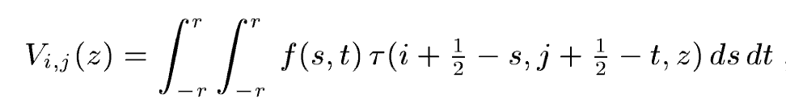
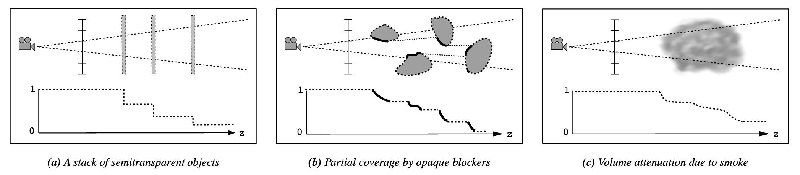
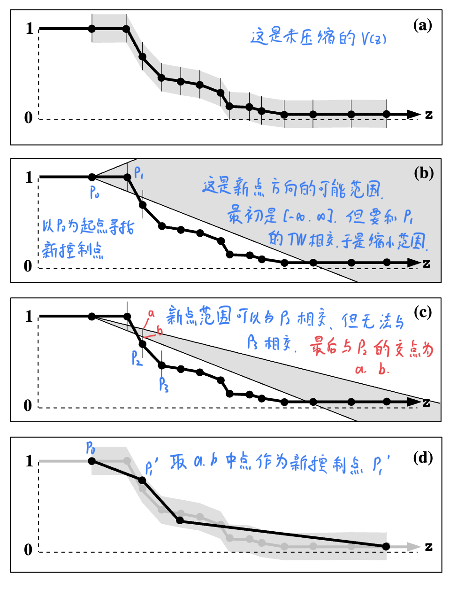
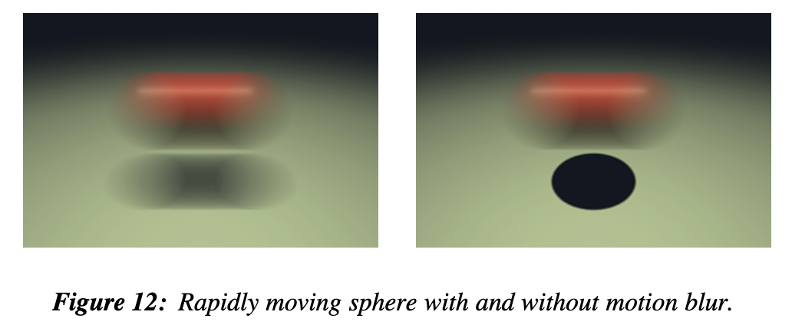
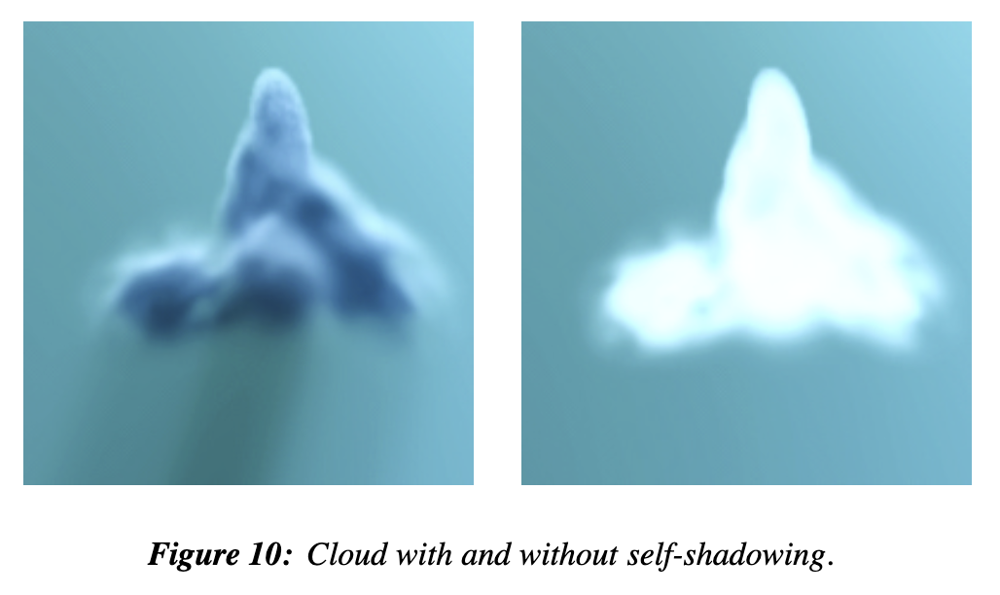
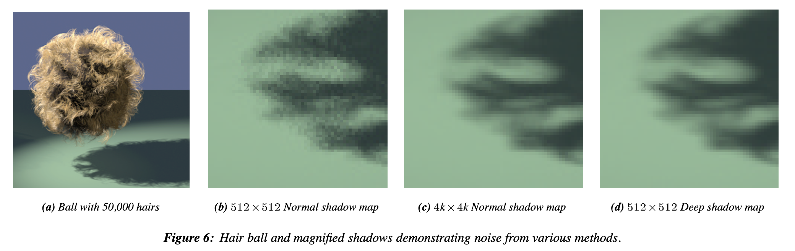

# Deep Shadow Map

传统的Shadow Map在每一个像素上存储一个深度信息，在渲染毛发、头发、烟雾时，自阴影十分重要，然而如果使用传统的ShadowMap，需要极高的精度、极多的采样才能实现。此外传统SM也无法处理体积体，因为沿着一条阴影射线去积分也极其低效

而Deep Shadow Map存储的是该像素在所有可能的位置上的可见性信息

> A deep shadow map stores a fractional visibility function (or simply visibility function) that records the approximate amount of light that passes through the pixel and penetrates to each depth

优点：

- DSM来自预计算，支持Mip-map，运行时查找效率更高
- 支持半透明物体、体积体的阴影，支持精密细节的物体（比如头发）
- 用于动态模糊（motion blur）时性能更好

### visibility function

从相机出发，可见性为1，随着深度的增加，与场景物体发生遮挡碰撞，最后衰减为0

- z：深度
- $\tau $：介质透光率（transmittance），是一个分段常数函数
- i、j：屏幕点坐标，$(i+1/2,j+1/2)$是阴影相机屏幕中心
- f：滤波器函数（滤波器的中心是阴影相机屏幕中心）
- r：滤波半径

### 生成

我们按深度将输入的顶点分为z层。对于每一层，每一个像素，我们使用多个采样点（比如16个），从采样点出发发射射线，记录该点的可见性，最终根据类型（半透明物体、体积体）加权混合采样点的结果
$$
V_{i,j}(z)=\sum_{k=1}^n \omega_k \tau_k(z)
$$

### 压缩

通常而言，visibility function是连续平滑的，非常便于压缩

函数对深度十分敏感，如果z方向精度下降，会极大影响自阴影的效果，此外z的范围也很大，$[0,\infty ]$

压缩的核心思想就是：在误差的许可范围内，画尽可能长的线

每次画线的起点都是确定的，我们只需要寻找方向和长度

1. 未压缩的函数是有多个控制点+线段构成的
2. 压缩后的新控制点与起点形成连线（他的可能方向是一个范围，图中灰色部分）
3. 新方向的射线应该能穿过压缩前控制点的target windows（图中竖线），见图b
4. 我们不断向后寻找压缩前的控制点，直到我们无法使用一条直线穿过当前所有压缩点的target windows
5. 此时我们找到了这个控制点最大的长度，两条连线和最后一个相交的target windows有两个交点，以交点连线的中点，作为新的控制点

### 缺点

1. 对于一个像素，我们要做更多的采样，于是计算量提高了。但是跟相同采样精度的传统shadowmap比，并没有提升很多，然而采样和存储的成本下降了
2. 大型物体的自阴影可能有bias，尽管传统shadowmap也有这个问题，但由于deep shadowmap鼓励使用大滤波宽度（当滤波宽度与信号宽度不一致，就会发生走样），所以这个现象更严重

### 实现上的问题

#### 增量更新

我们在生成visibility function时，对于每一个顶点做n次采样，这样的复杂度是$O(n^2)$，过于低效

作者提供了一种$O(n\log n)$的算法：

1. 将顶点按深度添加至堆中，根节点透光率为1
2. 遍历堆，对于每一个节点，使用父顶点和当前顶点更新透光率

$$
V'=V+\omega_j(\tau'_j-\tau_j)
$$

#### 颜色阴影

对于RGB三个通道单独存储透光率，这样阴影采样时就可以得到有颜色的阴影

#### Mip-Mapping

#### Tiling and Cache

我们以tile的形式存储deep shadow map，这允许我们只加载、缓存实际需要访问的map

#### Motion Blur

通过将随机时间和采样点混合，可以很好地支持动态模糊

### 最终结果

