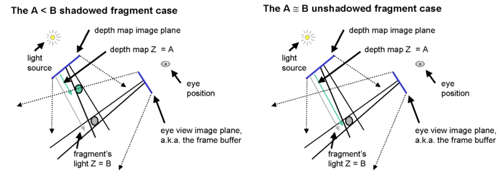
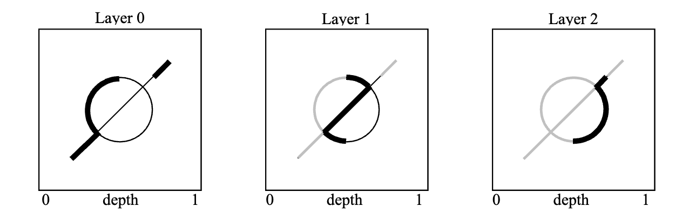

# Interactive Order-Independent Transparency

Depth Peeling（深度剥离）是一种片元（fragment）级的顺序无关的半透明渲染

### Shadow mapping

Shadow mapping是一个多pass阴影技术，第一个pass在光源处绘制一张深度图，在第二个pass投影到场景中

深度图中存储了距离灯光最近表面的深度，若在灯光空间，着色点深度>深度图深度，那么该着色点被遮挡，处于阴影中。若两者深度接近，则不在阴影中

### Depth Peeling

Alpha Test可以很好地顺序无关地得到距离最近的表面。然而，我们只能得到最近的表面，我们没法直接去渲染第二到第n近的表面

Depth Peeling解决了这个问题

我们使用深度测试可以得到距离最近的表面，然后再次进行深度测试，此时舍弃那些第一次测试时遇到的表面，这样就能得到第二近的表面，递归进行，就能得到所有表面

如下图从左向右看一个茶杯（俯视角），茶杯的深度被分为了三层

