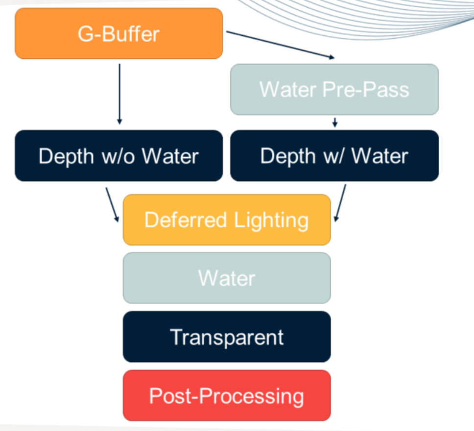
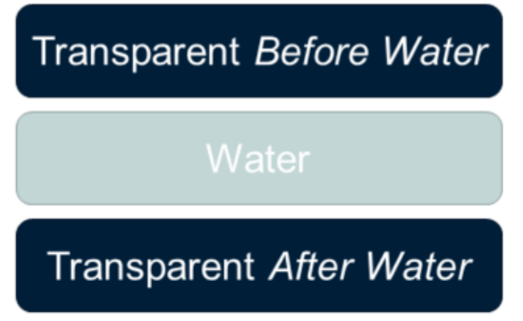
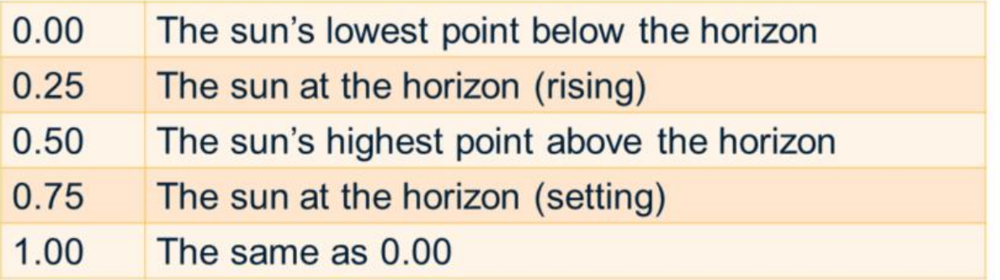

# Rendering an Open World in Far Cry 5

### Water

#### 渲染顺序

渲染水的第一要点是渲染顺序

育碧为了渲染水，使用了两种Depth Pass，一种是有水的，一种是没有水的

- 有水的depth buffer将用于SSLR（Screen Space Reflection的一种）
- 无水的depth buffer和传统一致，用于shadow、SSAO、lighting、fog、天空大气等

这样做的处理就是不需要在Water Pass进行写深度（无水的depth buffer），进而不会影响Transparent的渲染和SSLR的使用

为了能让水下的半透明物体能正常渲染，育碧又将半透明分成了两个部分

对于一个半透明物体，若这个像素位置上有水平面：

- 半透明在水面以上：先水再半透明
- 半透明再水面以下：先半透明再水
- 半透明和水面有交叉：在水的前后各画一次半透明

#### 水下

人在潜水状态，视野的深度都是含水的深度，而现在的方案是用无水的深度做effect

育碧的方案是：

- 关掉SSLR
- 仍然使用无水的深度做effect
- 翻转半透明物体和水平面的绘制顺序

### Time of day

- 首先在天空摆放太阳和月亮
- 根据经纬度和时间计算太阳月亮的位置，[计算公式](https://gml.noaa.gov/grad/solcalc/calcdetails.html)

- 计算太阳的radiance，月亮的albedo
- 计算月象（月亮性质和亮度）
- 使用太阳和月亮进行天空大气的计算

有些系统使用**太阳高度**（sun elevation）来实现每天的变换

### Tone Mapping

色调映射的作用是将原始的色调（高）映射到目标色调（低），在人眼的视觉特性下，对目标色调的还原效果不错（暗部提亮，亮部变暗）

- Global exposure：使用全屏亮度的平均值
- Local exposure：使用平面上某region的亮度平均值

