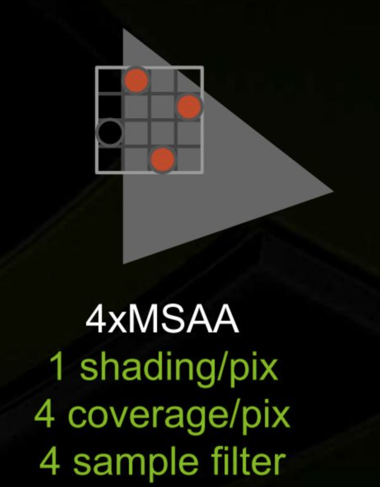
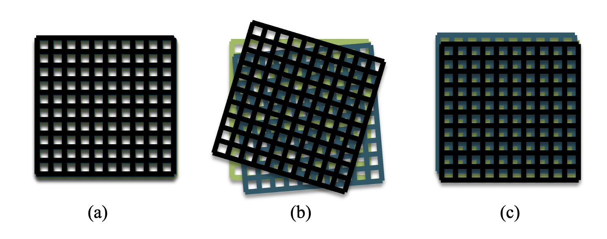
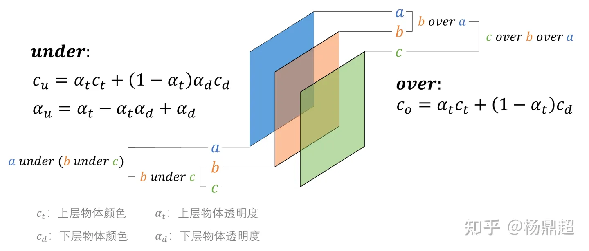
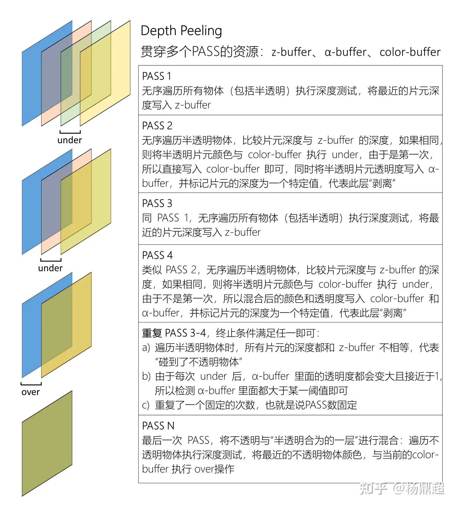
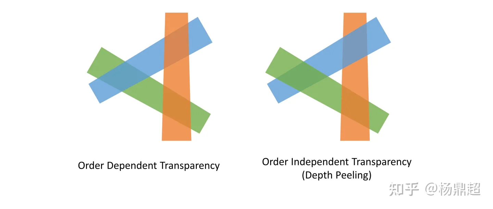

# Weighted Blended Order-Independent Transparency

许多半透明特效（比如云雾火焰，不发生折射的玻璃），就是将渲染结果覆盖在像素上。

传统的顺序无关的半透明渲染（OIT）主要有几种方案

- 一个像素多次采样，将Alpha转化为binary coverage
- 存储距离表面最近的表面子集
- 
- 重新定义混合运算符，使其支持顺序无关运算

### Alpha Test

透明度测试，这是一种极其简单、低效的半透明绘制方法，就是在像素着色器中设置一个alpha门槛，当低于这个alpha就clip掉

```glsl
clip(texColor.a - ALPHA);
```

- 优点
  - 顺序无关，性能良好
- 缺点
  - 像素只有完全透明和完全不透明两个状态，本质上是一种带孔洞的不透明
  - 在边缘处效果较差，可能出现黑边

#### Alpha Coverage

透明度覆盖，这是基于MSAA对透明度测试的改进。

MSAA对于一个像素会进行多次采样，得到采样点被像素覆盖的数量（比例），以此得到该像素的alpha，然后再使用这个alpha进行透明度测试，透明度测试是顺序无关的，自然Alpha Coverage也是顺序无关的



### Alpha Blend

透明度混合，我们前面说半透明本质就是将新的像素覆盖到原有像素上，那么我们得到原有像素，根据alpha值进行加权混合，就能得到新的像素颜色
$$
C_f=C_1+(1-\alpha_1)C_0
$$

- 优点
  - 能得到一个合理的过渡颜色
- 缺点
  - 必须对所有半透明物体进行排序，从下到上进行混合
  - 不能对两个半透明物体进行混合，只能由一个不透明物体和半透明物体混合，他们的混合结果是一个不透明物体，再继续向上混合
  - 多次混合，大量overdraw，性能差
  - 由于半透明物体不做深度测试，因此需要提前对被遮挡的半透明物体做剔除
  - 对齐理论




### Depth Peeling

逐层剥离，是Alpha Blend的改进

上面半透明混合时，是从最底层开始向上覆盖，而逐层剥离是从顶层开始一层层向下剥离。Alpha Blind的over操作只能进行半透明和不透明间的混合

而Depth Peeling的under操作能实现不透明间的混合，先将所有的半透明物体进行混合（under），最后将一张半透明物体和不透明物体进行混合，得到最终结果





- 优点
  - under操作是顺序无关的
  - 能解决半透明物体互相交叉
- 缺点
  - 使用多个pass，性能较差




### 参考

https://zhuanlan.zhihu.com/p/368065919