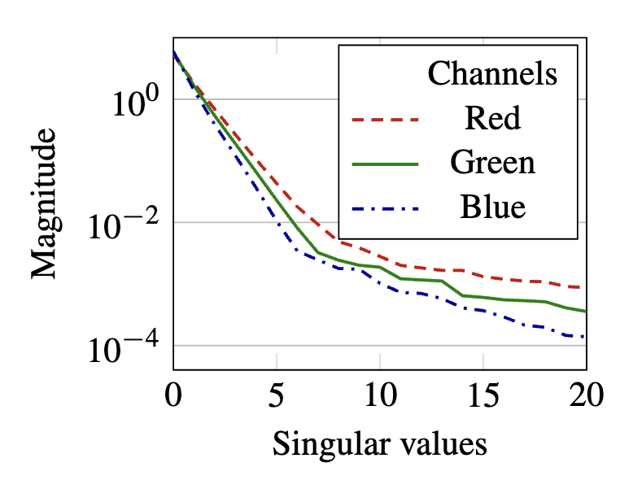

# Separable Subsurface Scattering

半透明物体的渲染重要且复杂，次表面散射（subsurface scattering）模拟光在半透明介质内的折射散射过程，十分昂贵，实时渲染没法用，于是人们找出了许多trick方案

### 高斯模糊

最常见的SSS渲染方式利用了SSS的宏观现象：让高频信息变得模糊。

于是我们就可以使用卷积的方式对漫反射进行模糊。为了提高性能，我们可以分别对xy方向进行模糊，最后进行归约

不过还是太昂贵了

### 作者的算法

#### 可分离的次表面散射SSSS

使用两张1D扩散刨面（diffusion profile），他们分别代表xy方向能量的扩散，我们使用他们的张量积来近似扩散核（diffusion kernel，$R_d(x,y)$）

如果我们要计算SSS后某点$(x,y)$的辐射出照度$M_e$，只需要在xy方向对原图进行滤波
$$
M_e(x,y)=\int_{\mathbb{R}^2}E(x',y')R_d(x-x',y-y')\mathrm{d}x'\mathrm{d}y'=(E*R_d)(x,y)
$$

- $E$：原图某点的辐照度（Irradiance）

#### 2D扩散核的近似

不过实时做这个积分也不现实，我们将连续函数的积分转化为**离散**元素之和
$$
(E*R_d)(x,y) \approx (E*A)(x,y) \approx \sum_{i=1}^N ((E*a_i)*a_i)(x,y)
$$
此外我们还发现，扩散核前几奇异值（Singular values）就包含了绝大部份能量，于是我们只需要**分离**前面一部分，就能得到相对精确的数据

现在我们需要一个离散可分离核（singular value decomposition，SVD）的方案

作者只使用一阶SVD来重建扩散核（一般而言误差很大，但在某些情况效果也很好）

#### 预积分可分离扩散核

