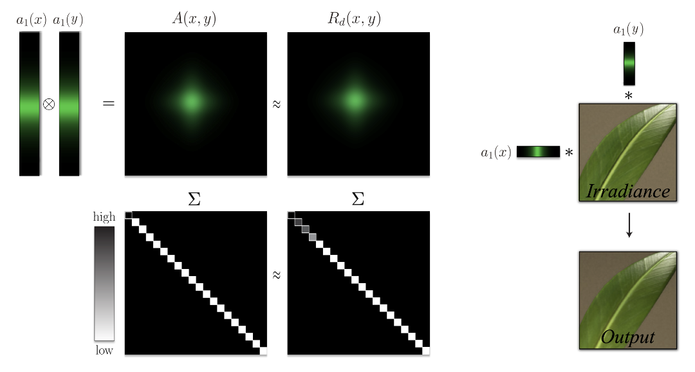

# Separable Subsurface Scattering

半透明物体的渲染重要且复杂，次表面散射（subsurface scattering）模拟光在半透明介质内的折射散射过程，十分昂贵，实时渲染没法用，于是人们找出了许多trick方案

### 高斯模糊

最常见的SSS渲染方式利用了SSS的宏观现象：让高频信息变得模糊。

于是我们就可以使用卷积的方式对漫反射进行模糊（常用高斯模糊）。为了提高性能，我们可以分别对xy方向进行模糊，最后进行归约

不过还是太昂贵了，这篇文章的核心就是找到了一种更高效的模糊算法，模糊效果和高斯模糊相似

### 获得扩散核

作者的方法也是模糊，但是通过预积分的方式减少了滤波数量。

#### 可分离的次表面散射SSSS

散射剖面（diffusion profile）：用于刻画光（在无穷大表面）能散射多远，以2D散射剖面为例，我们向中间发射一道激光，光线经过散射后会让附近范围的表面发亮

使用两张1D扩散剖面的张量积来近似扩散核（diffusion kernel，$R_d(x,y)$）

如果我们要计算SSS后某点$(x,y)$的辐射出照度$M_e$，只需要在xy方向对原图进行滤波
$$
M_e(x,y)=\int_{\mathbb{R}^2}E(x',y')R_d(x-x',y-y')\mathrm{d}x'\mathrm{d}y'=(E*R_d)(x,y)
$$

- $E$：原图某点的辐照度（Irradiance）

#### 2D扩散核的近似

不过实时做这个积分也不现实，我们将连续函数的积分转化为**离散**元素之和
$$
(E*R_d)(x,y) \approx (E*A)(x,y) \approx \sum_{i=1}^N ((E*a_i)*a_i)(x,y)
$$
此外我们还发现，扩散核前几奇异值（Singular values）就包含了绝大部份能量，于是我们只需要**分离**前面一部分，就能得到相对精确的数据

现在我们需要一个离散可分离核（singular value decomposition，SVD）的方案

作者只使用一阶SVD来重建扩散核（一般而言误差很大，但在某些情况效果也不错）

### 渲染

得到了扩散核，现在要用，作者的方案可以用在texture上，也可以用于后处理。作者还做了一些优化

详细SSS渲染见GPU Gems 3

#### Jittering

作者的方案在处理较小的物体时，扩散核往往不是圆的，而且星型的（其实上面那个绿色的图就已经有点方了），出现这个的原因是要着色的物体太小了，比扩散核的步长要小

于是引入了Jittering，我们对滤波轴上的点进行随机旋转，这样就不会出现十字形（星型）轮廓，而且由于扩散核是旋转对称的，因此数据也不会错（旋转时不会改变距离）

此外该功能只对比较小的物体使用（大小小于扩散核的1/10）

#### 重要性采样

扩散核中心亮度变化大，边缘变化小，于是我们提高在中心的采样频率

#### 曲面

扩散核表示的是光线在无穷大的平面的扩散距离，而实际上物体表面是弯曲的，会形成角度

- $\theta$：法线N和光源L的夹角

我们将$\theta$和$r$映射到xy轴，就能得到LUT表

