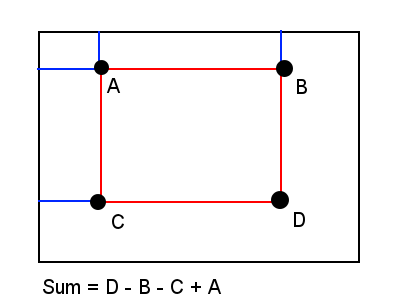

# Summed-Area Tables for Texture Mapping

通过预计算，可以提高贴图映射的效率

- mipmap，一组离散的分辨率递减（提前滤波）的贴图，使用时根据level进行采样，可以提高性能
- 使用单个值来表示函数的积分

贴图映射时，会发生扭曲变形，3D贴图更会加剧这一过程。一个常见的贴图映射：将一个正方形贴图映射到球上。我们会发现在球的两级纹素比更高（很显然，这个映射径向不均匀），于是就会产生走样（采样频率与信号频率不同，就会走样），而且靠艺术家解决这个问题是很不现实的

为了解决这个问题，我们就需要做滤波，当纹素比非常大时（一个像素上有特别多个纹素），传统的滤波方案是很费的

### 相关工作

跟作者同时代的人提出了很多方案，但都过于昂贵，与像素数有关，而且中间有精度丢失。

其中有一种方案是对贴图横向滤波一次，再纵向滤波一次，将nxn转化为2n，而且该算法可以硬件加速（高斯模糊的优化）

还有人提出使用mipmap进行滤波，我们保存几个固定level的map，运行时寻找相邻两个level进行滤波，再将两个滤波结果做线性插值（三线性滤波）

### SAT

作者提出了一个基于预计分的和像素数无关的完全准确的滤波方案，思路简单来说就是**前缀和**

如图，我们想求图1中某个矩形区域（紫色）内数值之和，我们可以先将整个图进行积分，得到图2，然后用图2的四个顶点进行运算

而且构建这个SAT也非常简单，横向各做前缀和，再纵向各做前缀和，这个过程可以并行做（使用Compute Shader）

