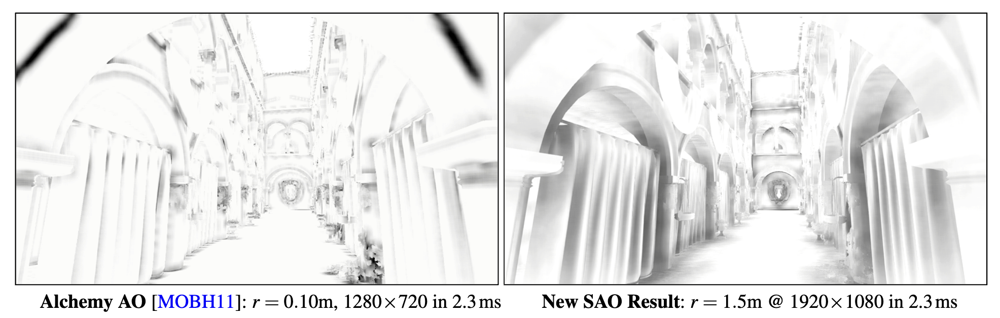
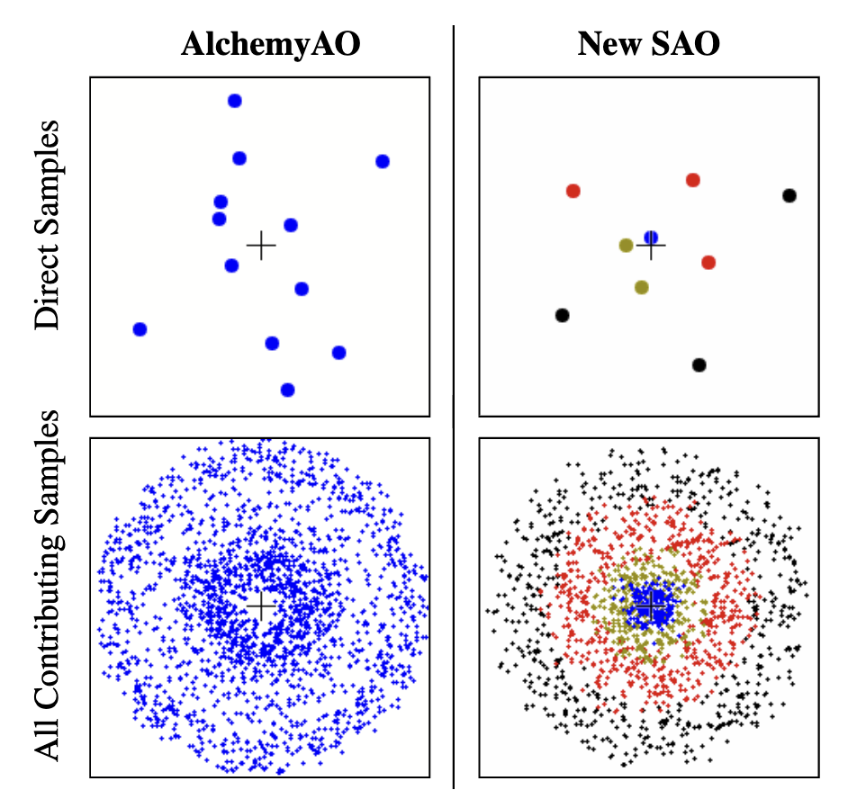

# Scalable Ambient Obscurance

这是SSAO的改进，SSAO就是在延迟渲染中，根据depth buffer、uv、矩阵的逆得到世界空间坐标，向半球面方向上延伸，得到新的坐标，通过判断新坐标的可见性来得到AO。新坐标的可见性有多种方案，比如随机半球光线步进，比如半球面切西瓜，比如转化到相机空间比较深度

所以这篇文章到底改进了啥？感觉就是很普通的Hi-Z+比较相机空间深度的AO方案，也可能是文章比较老？



### 算法

该算法输入depth buffer，输出屏幕像素ao

#### 1. High-Precision z Prepass

我们将使用depth buffer重建世界坐标，因此对z的精度要求很高

作者做了

- 以双精度计算矩阵
- 远平面$z_f=- \infty$（一般而言远平面z与视锥深度有关）
- 左乘矩阵（why？）

> When using column-major matrices (the default in OpenGL), multiply vectors on the left ($\mathbf{v'}$ = $\mathbf{v'P}$) in the vertex shader. This saves about half a bit of precision

#### 2. Hierarchical z Pass

这个pass用于生成Hi-Z，将$[0,1]$的depth buffer转化为$[-\infty,0]$的camera-space z
$$
z(d)=\frac{\mathbf{c_0}}{d \cdot \mathbf{c_1}+\mathbf{c_2}}
$$
其中近平面z为$z_n$，远平面z为$z_f=-\infty$

得到的z存储在texture中，并生成mipmap 

#### 3. Distributed AO Sample Pass

该算法通过比较相机空间深度，来判断点的可见性，进而得到AO

1. 基于深度z和屏幕像素恢复出相机空间坐标C和法线n

2. 在C附近半球面上按螺旋方式撒s个采样点

$$
r_{c}=-r_wS'/z_C
$$

- $r_c$：相机空间球半径
- $r_w$：世界空间球半径
- $S'$：1m的物体在像素中点尺寸



3. 基于mipmap采样深度

```glsl
//求mipmap层级
int m = clamp(findMSB(int(h)) − log_q, 0, MAX_MIP);
//mipmap采样
float z = texelFetch(zBuffer, ivec2(h∗u+xy) >> m, m).r;
```

4. 计算AO，将AO和z进行编码，传给下一个pass（为了减少带宽）

#### 4. Bilateral Reconstruction Passes

双重滤波，增强效果

